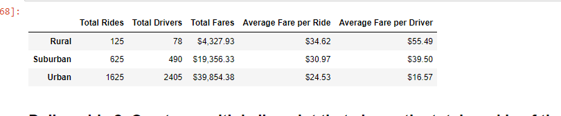
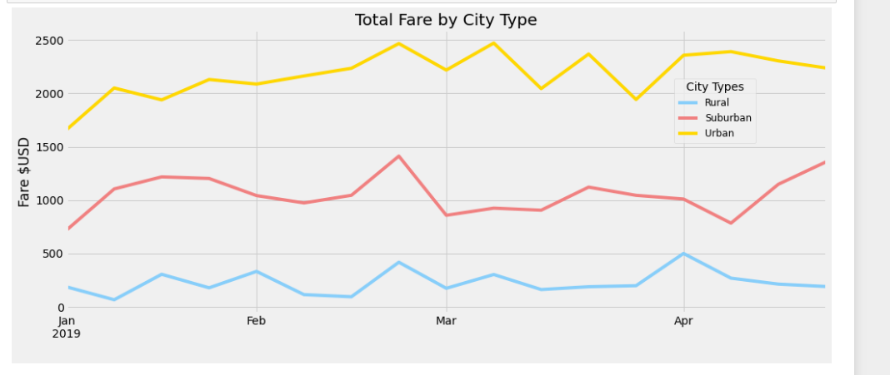

# PyBer_Analysis
## Purpose
As the new data analyst at PyBer, I am ask to do an exploratory analysis on some really large CSV files. To Aid this process, we created several types of visualizations to help us make a better report. The report and Visualizations will help our company to improve access to ride sharing service and determine affordability for underserved neighborhoods. In this challenge we will create a multiple line graph that shows the total weekly fares for each city type
## Results
The data su

